# 🏥 HealthGPT SA - AI-Powered Healthcare Platform

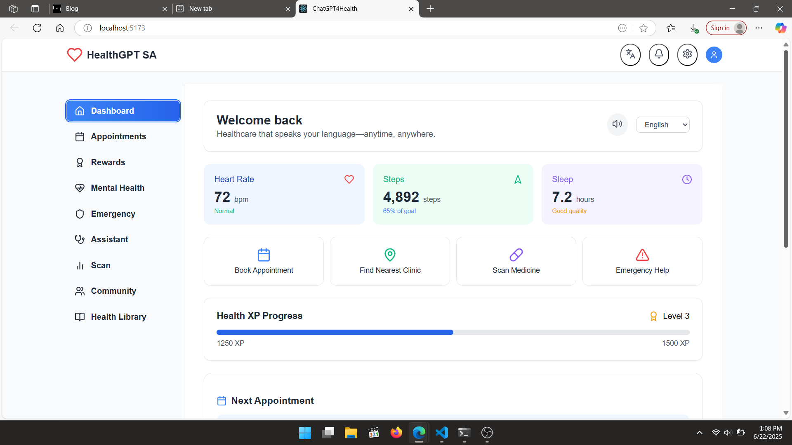

> **A revolutionary AI-powered healthcare platform designed to make healthcare accessible, personalized, and engaging for South Africans.**

## 🌟 Features

### 📚 **Health Library**
- Doctor-reviewed articles
- Educational videos
- Condition information
- Saved articles functionality
- Trending health topics

### 🎮 **Gamified Learning**
- Interactive health education games
- XP and badge reward system
- Community leaderboard
- Health knowledge challenges

### 🏠 **Dashboard View**
- Personalized health metrics tracking
- Quick access to essential services
- Appointment reminders and health tips
  
### 🗓️ **Appointments View**
- Clinic discovery and booking system
- Upcoming appointments tracking
- Video consultation options
  
### 🤖 **AI Assistant View**
- Medical image analysis
- Prescription reader
- Drug interaction checker
- Symptom severity assessment
- AI-powered medical chat
  
### 👥 **Community View**
- Health-focused social feed
- Local health events
- Support groups

### 🧠 **Mental Health View**
- Mood tracker
- Crisis support contacts
- Counselor booking

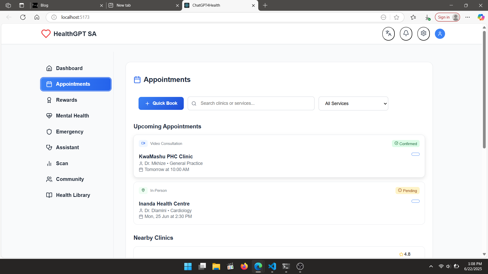
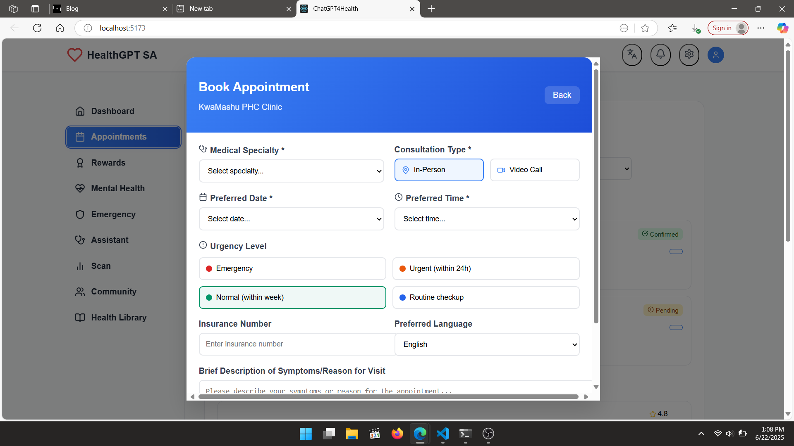
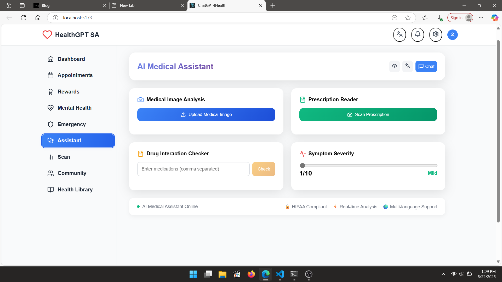

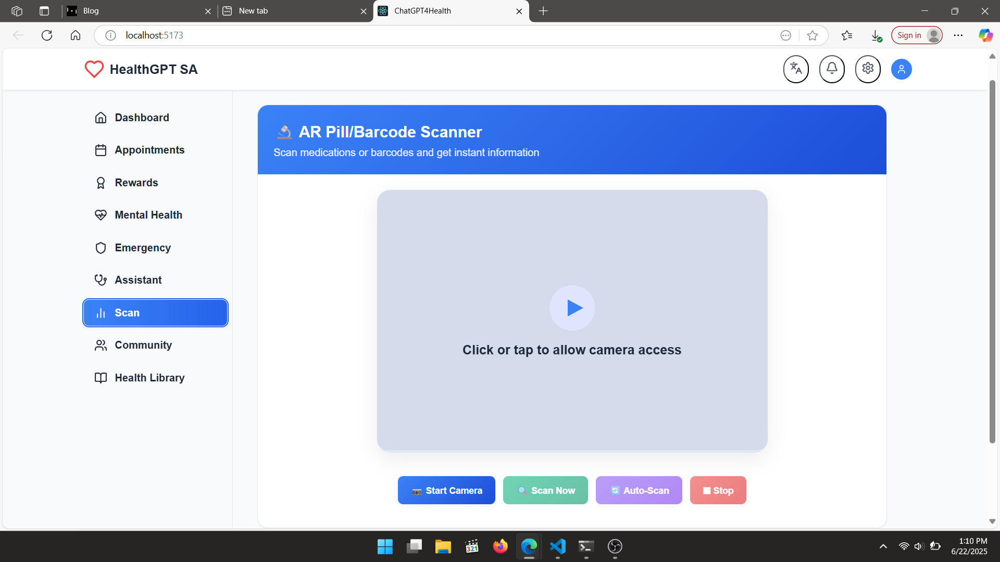
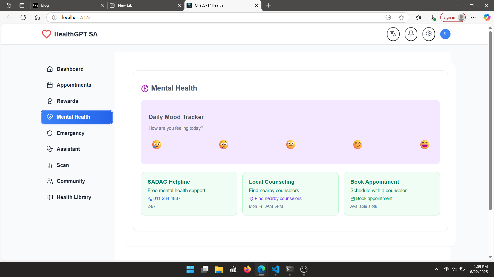
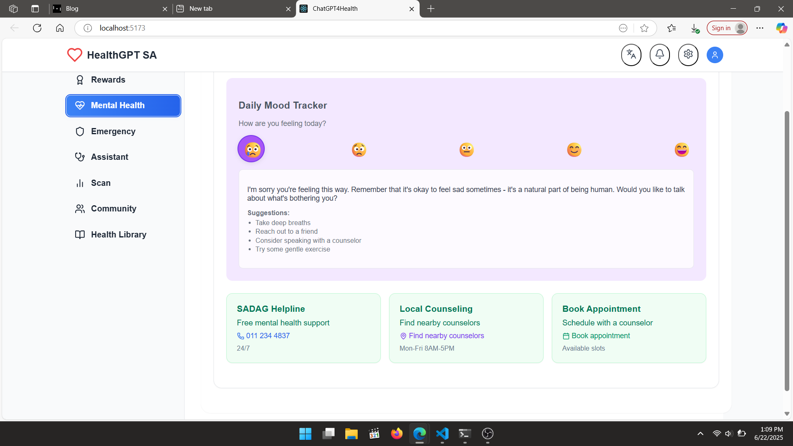
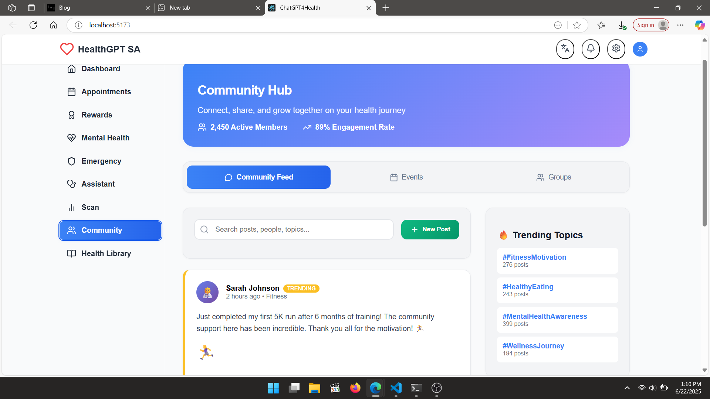
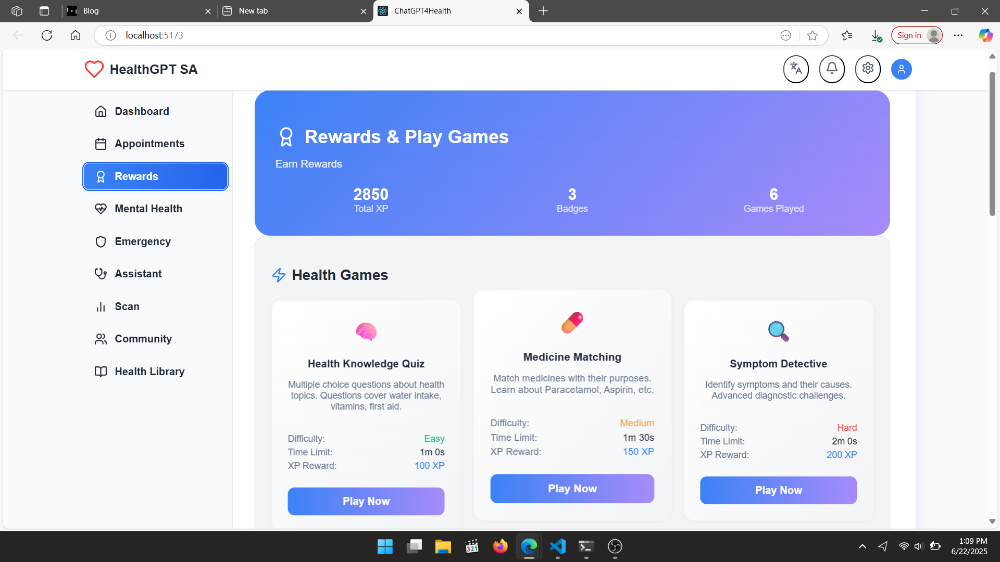
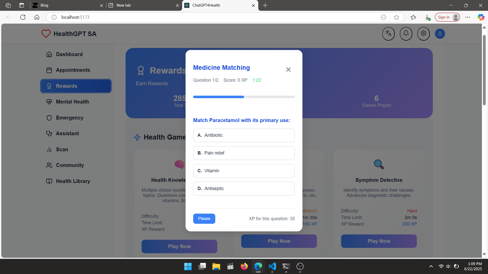
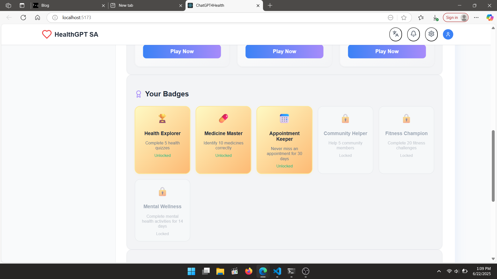
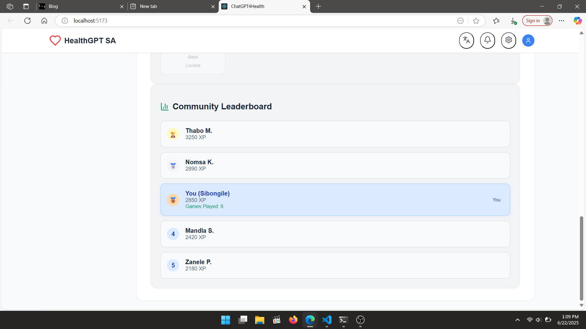
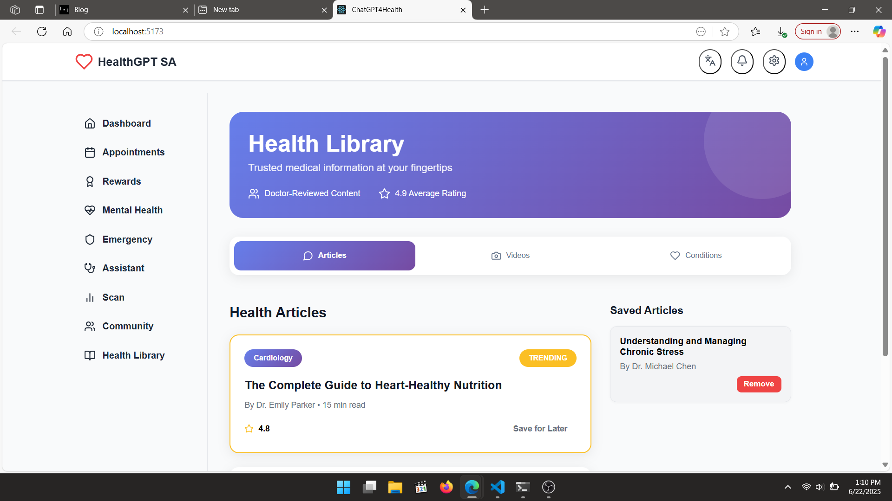
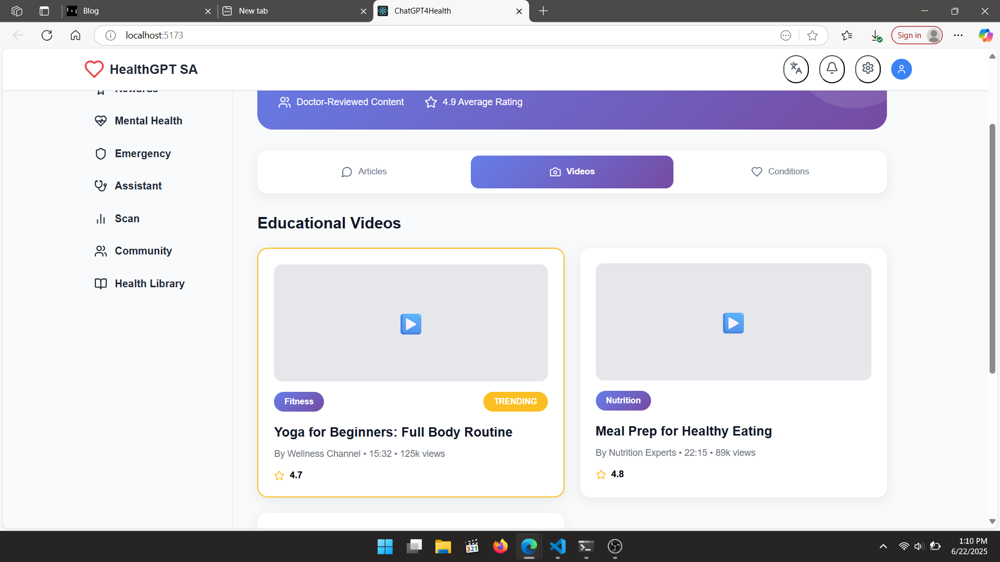
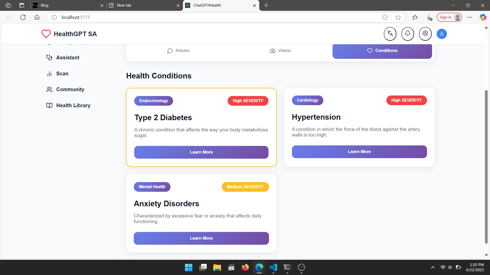
